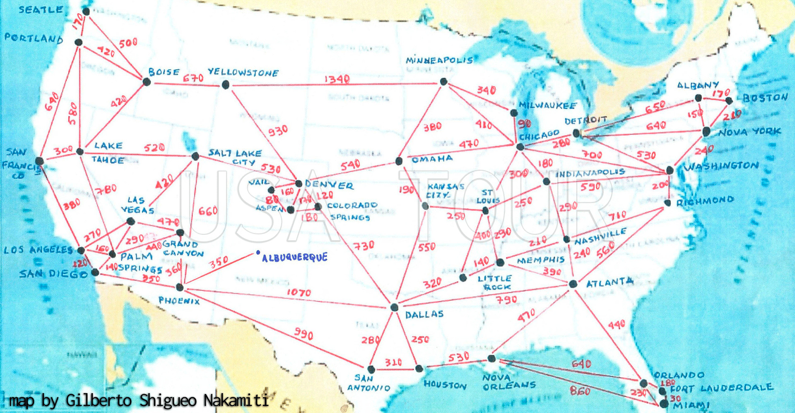

# The project

A graph algorithm program written in C++ to find the shortest way to run out through all points from an initial one. Developed as a project to my university course.
The program itself is in portuguese language.

# USA Tour

Users are able to:

- Search the shortest way between two points (aka places) 
- Do a tour through all locations options and returns to the selected origin place

# Instructions

## Common users
1. Go to releases tab 
2. Download the USA-Tour.exe 
3. Run

## Pro users
1. Clone or download zip our project via github 
2. Open a terminal/cmd windows at "src" folder 
3. Using a compiler with multi-library support, type "g++ -std=c++11 main.cpp -o main" to ensure that you'll get no errors 
4. Run the compiled file with "./main" in the terminal/cmd

# Developers

Erick M. L. Pacheco 
Leonardo Sanavio

Thanks!
